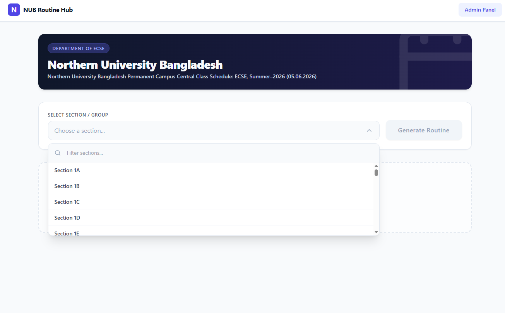
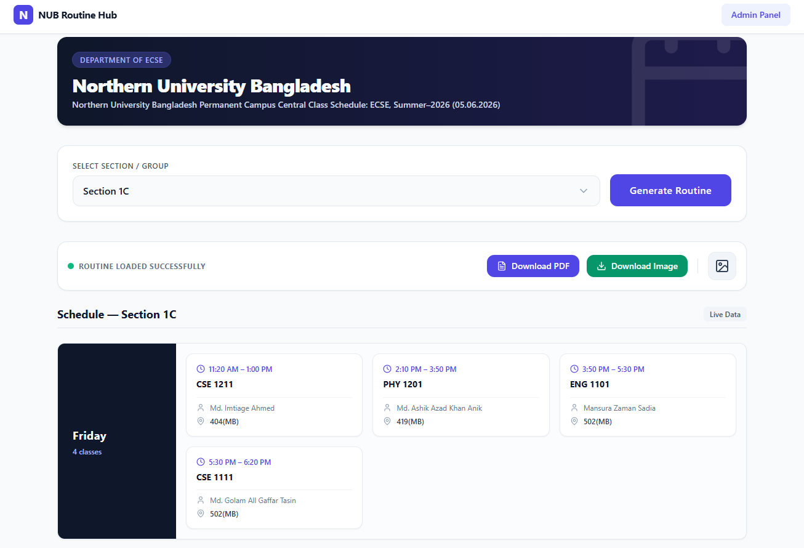
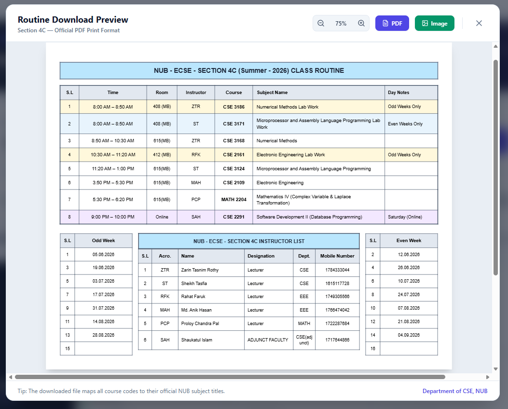

# NUB Routine Hub

A class schedule viewer for ECSE students at Northern University Bangladesh. Select your section and instantly view your weekly routine — with full instructor details, room numbers, and odd/even week lab splits. Export as PDF or image in the official NUB print format.

🔗 **Live site:** [routine-parser.netlify.app](https://routine-parser.netlify.app)

---

## Screenshots

**Select your section from the dropdown**



**View your full weekly schedule**



**Download in official NUB print format**



---

## Features

- Browse all ECSE sections for the current semester
- Weekly schedule grid with time slots, room numbers, and instructor names
- Odd/even week lab class indicators
- Download as PDF or image in the official NUB class routine format
- Instructor list with designations, departments, and contact numbers
- Odd/even week calendar included in the download
- Admin panel for uploading a new semester's Excel schedule file

---

## Tech stack

| Layer | Technology |
|---|---|
| Frontend | React 18, Vite 5, Tailwind CSS |
| Backend | FastAPI, Python |
| Parsing | openpyxl |
| Export | Client-side PDF and image generation |
| Analytics | Google Analytics 4 |

---

## Getting started

### Prerequisites

- Python 3.x
- Node.js 18+

### Run locally

1. Clone the repository:
   ```bash
   git clone https://github.com/SaimHasanD/Routine_Parser.git
   cd Routine_Parser
   ```

2. Start the backend:
   ```bash
   cd backend
   pip install -r requirements.txt
   python -m uvicorn app.main:app --reload --port 8000
   ```

3. Start the frontend (new terminal):
   ```bash
   cd frontend
   npm install
   npm run dev
   ```

4. Open [http://localhost:5173](http://localhost:5173)

> The backend automatically loads the current semester's schedule on startup. No manual upload needed for development.

---

## Admin panel

A password-protected panel is available at [/admin](https://routine-parser.netlify.app/admin) for uploading a new Excel schedule file at the start of each new semester.

---

## Project structure

```
Routine_Parser/
├── assets/                  # Repo images for README
├── backend/
│   └── app/
│       ├── main.py          # FastAPI app, routes, lifespan autoload
│       ├── parser.py        # Top-level Excel parser
│       ├── cell_parser.py   # Regex cell extractor
│       ├── header_parser.py # Time slot mapper
│       ├── merge_resolver.py# Merged cell handler
│       ├── faculty_mapper.py# Acronym → full name resolver
│       ├── section_regular.py
│       ├── section_lab.py
│       ├── section_online.py
│       ├── models.py        # Pydantic response schemas
│       └── state.py         # In-memory schedule store
└── frontend/
    └── src/
        ├── screens/         # DashboardScreen, UploadScreen
        ├── components/      # RoutineTable, RoutineDownloadLayout
        └── services/api.js  # Backend HTTP gateway
```

For a full file-by-file breakdown and API reference, see [CURRENT_STATE.md](CURRENT_STATE.md).

---

## Contributing

Pull requests are welcome. For major changes, please open an issue first to discuss what you would like to change.